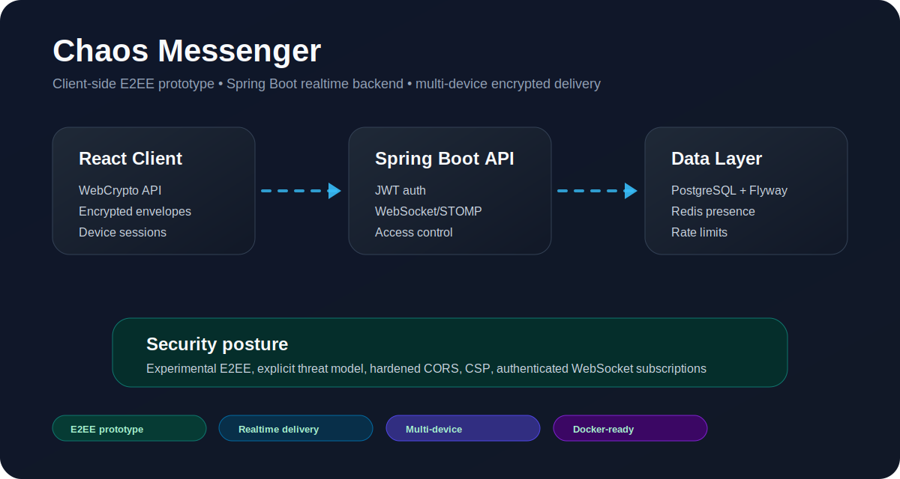

<div align="center">

```
░█████╗░██╗░░██╗░█████╗░░█████╗░░██████╗
██╔══██╗██║░░██║██╔══██╗██╔══██╗██╔════╝
██║░░╚═╝███████║███████║██║░░██║╚█████╗░
██║░░██╗██╔══██║██╔══██║██║░░██║░╚═══██╗
╚█████╔╝██║░░██║██║░░██║╚█████╔╝██████╔╝
░╚════╝░╚═╝░░╚═╝╚═╝░░╚═╝░╚════╝░╚═════╝░
```

### Secure realtime messenger with client-side E2EE architecture

*Spring Boot 3 · React/Vite · WebSocket/STOMP · PostgreSQL · Redis · Flyway · Swagger · Prometheus · Grafana*

[🇷🇺 Русская версия](README.ru.md) · [🚀 Quick Setup](SETUP_COMPLETE.md) · [⚡ Быстрый запуск RU](SETUP_COMPLETE.ru.md)

<br/>

[](https://github.com/vaazhen/chaos-messenger/actions/workflows/ci.yml)
[](https://openjdk.org/)
[](https://spring.io/projects/spring-boot)
[](https://react.dev/)
[](https://www.postgresql.org/)
[](https://redis.io/)
[](https://stomp.github.io/)
[](http://localhost:8080/swagger-ui.html)

<br/>

[Overview](#overview) · [Features](#features) · [Architecture](#architecture) · [Quick Start](#quick-start) · [API](#api) · [Monitoring](#monitoring) · [Developer Notes](#developer-notes)

</div>

---

## Overview

**Chaos Messenger** is a full-stack realtime messenger focused on secure message transport, client-side encryption and multi-device delivery.

The backend does not work with plaintext message content. It authenticates users, manages chats and devices, stores encrypted envelopes, and delivers them over WebSocket/STOMP to the correct recipient devices.

<p align="center">
  
</p>

This repository is useful as:

- a serious Java Backend / Fullstack portfolio project;
- a reference architecture for realtime messaging on Spring Boot;
- a practical example of encrypted-envelope delivery;
- a base for Android, encrypted media and WebRTC extensions.

---

## Features

<table>
<tr>
<td width="50%">

### Security and encryption

- Client-side encrypted messages.
- Device-based encrypted envelopes.
- Session bootstrap with prekeys.
- Signed prekey verification.
- Symmetric ratchet movement for message keys.
- JWT authentication.
- Redis-backed SMS rate limiting.
- Hardened WebSocket authorization.
- Explicit CORS origins and security headers.

</td>
<td width="50%">

### Messaging

- Direct one-to-one chats.
- Group chats.
- Realtime delivery over WebSocket/STOMP.
- Typing indicators.
- Delivery and read statuses.
- Replies and message editing.
- Soft deletion.
- Photo attachments.
- User profiles and emoji avatars.

</td>
</tr>
<tr>
<td width="50%">

### Backend

- Spring Boot 3.
- Spring Security.
- PostgreSQL.
- Redis.
- Flyway database migrations.
- OpenAPI / Swagger UI.
- Actuator metrics.
- Prometheus endpoint.
- Grafana dashboard assets.
- Docker Compose for local infrastructure.

</td>
<td width="50%">

### Frontend

- React 18.
- Vite.
- WebCrypto-based crypto engine.
- ES-module frontend crypto layer.
- Telegram-style messenger UI.
- Device identity stored on the client side.
- WebSocket client integration.
- Frontend unit tests.

</td>
</tr>
</table>

---

## Architecture

```text
React / Vite client
  ├─ REST API: auth, users, profile, chats, messages, devices
  ├─ WebSocket/STOMP: message events, typing, presence, chat updates
  └─ WebCrypto: client-side message encryption

Spring Boot backend
  ├─ Auth and JWT
  ├─ Chat and message orchestration
  ├─ Device registry and encrypted envelope fanout
  ├─ WebSocket authorization
  ├─ Redis: refresh tokens, presence, rate limits
  └─ PostgreSQL: users, chats, messages, envelopes, devices

Observability
  ├─ Spring Boot Actuator
  ├─ Prometheus
  └─ Grafana dashboard
```

The important design decision is separation of responsibilities:

- **Client** creates keys, encrypts/decrypts messages and owns plaintext.
- **Backend** validates access, stores encrypted envelopes and routes realtime events.
- **Database** stores application state and encrypted payloads.
- **Redis** handles fast ephemeral state: refresh tokens, presence and rate limits.

---

## Quick Start

Full guide:

- [SETUP_COMPLETE.md](SETUP_COMPLETE.md) — English quick setup.
- [SETUP_COMPLETE.ru.md](SETUP_COMPLETE.ru.md) — Russian quick setup.

### Requirements

```bash
java -version      # Java 17+
mvn -version       # Maven 3.8+
node --version     # Node.js 18+
docker --version
docker compose version
```

### Start infrastructure

```bash
cd backend
docker compose -f docker-compose.dev.yml up -d
```

### Start backend

```bash
mvn spring-boot:run
```

### Start frontend

```bash
cd frontend
npm install
npm run dev
```

Open the application:

```text
http://localhost:5173
```

Development SMS codes are printed in backend logs.

---

## Local URLs

| Service | URL |
|---|---|
| Web Client | `http://localhost:5173` |
| Backend API | `http://localhost:8080` |
| Swagger UI | `http://localhost:8080/swagger-ui.html` |
| OpenAPI JSON | `http://localhost:8080/api-docs` |
| Actuator Health | `http://localhost:8080/actuator/health` |
| Prometheus Metrics | `http://localhost:8080/actuator/prometheus` |
| Prometheus UI | `http://localhost:9090` |
| Grafana | `http://localhost:3000` |

Grafana default login for local Docker Compose:

```text
admin / admin
```

---

## API

Swagger UI is available after backend startup:

```text
http://localhost:8080/swagger-ui.html
```

OpenAPI JSON:

```text
http://localhost:8080/api-docs
```

### Main API areas

| Area | Purpose |
|---|---|
| Auth | Phone login, OTP verification, JWT refresh |
| Profile | User profile, username, display name, avatar |
| Devices | Device registration, prekeys, signed prekeys |
| Chats | Direct chats, group chats, chat list |
| Messages | Send/edit/delete messages, statuses |
| WebSocket | Realtime delivery, typing, presence, chat updates |

### Example local flow

```text
1. Register/login by phone.
2. Complete profile.
3. Register device keys.
4. Create or open a chat.
5. Send encrypted envelopes.
6. Receive realtime events over WebSocket.
```

---

## WebSocket Topics

| Topic | Purpose |
|---|---|
| `/topic/devices/{deviceId}` | Per-device encrypted message delivery |
| `/topic/users/{username}/chats` | Chat-list updates for a specific user |
| `/topic/chats/{chatId}/typing` | Typing events in a chat |
| `/topic/user/status` | Presence and status events |

WebSocket connections use Bearer JWT authentication.

---

## Monitoring

The project includes Spring Boot Actuator, Prometheus configuration and Grafana dashboard provisioning.

Start the full monitoring stack:

```bash
cd backend
docker compose up -d prometheus grafana
```

Then open:

```text
Prometheus: http://localhost:9090
Grafana:    http://localhost:3000
```

Grafana dashboard provisioning files:

```text
backend/src/main/resources/grafana-datasource.yml
backend/src/main/resources/grafana-dashboards.yml
backend/src/main/resources/chaos-messenger-dashboard.json
```

Prometheus scrapes:

```text
http://localhost:8080/actuator/prometheus
```

---

## Project Structure

```text
.
├── .github/workflows/          # GitHub Actions CI
├── backend/                    # Spring Boot backend
│   ├── src/main/java/...       # Application code
│   ├── src/main/resources/     # Config, Flyway, Grafana, i18n
│   ├── docker-compose.dev.yml  # PostgreSQL + Redis for development
│   └── docker-compose.yml      # App + PostgreSQL + Redis + monitoring
├── frontend/                   # React/Vite client
│   ├── src/crypto-engine.js    # Frontend WebCrypto engine
│   ├── src/components/         # UI components
│   └── src/hooks/              # Auth, chats, messages, WebSocket hooks
├── docs/assets/                # README images and diagrams
├── README.md                   # English README
├── README.ru.md                # Russian README
├── SETUP_COMPLETE.md           # English setup guide
└── SETUP_COMPLETE.ru.md        # Russian setup guide
```

---

## Developer Notes

### Backend checks

```bash
cd backend
mvn test
mvn spring-boot:run
```

### Frontend checks

```bash
cd frontend
npm test
npm run build
```

### CI

GitHub Actions workflow is located at:

```text
.github/workflows/ci.yml
```

The pipeline covers backend checks and frontend test/build.

---

## Environment

Backend:

```env
JWT_SECRET=change-this-to-a-strong-32-plus-character-secret
JWT_EXPIRATION=86400000
CHAOS_CORS_ALLOWED_ORIGINS=http://localhost:5173
SPRING_DATASOURCE_URL=jdbc:postgresql://localhost:5432/chaos_messenger
SPRING_DATASOURCE_USERNAME=postgres
SPRING_DATASOURCE_PASSWORD=postgres
SPRING_DATA_REDIS_HOST=localhost
SPRING_DATA_REDIS_PORT=6379
```

Frontend:

```env
VITE_BACKEND_URL=http://localhost:8080
VITE_API_BASE=http://localhost:8080/api
VITE_WS_URL=http://localhost:8080/ws
```

---

## Roadmap

- Android client.
- Android Keystore integration.
- Push notifications.
- Encrypted voice messages.
- Encrypted media storage.
- WebRTC calls.
- TURN/STUN infrastructure.
- Deployment profiles for staging and production.
- Extended integration tests and load tests.

---

## License

Add a license file before accepting external contributions.
